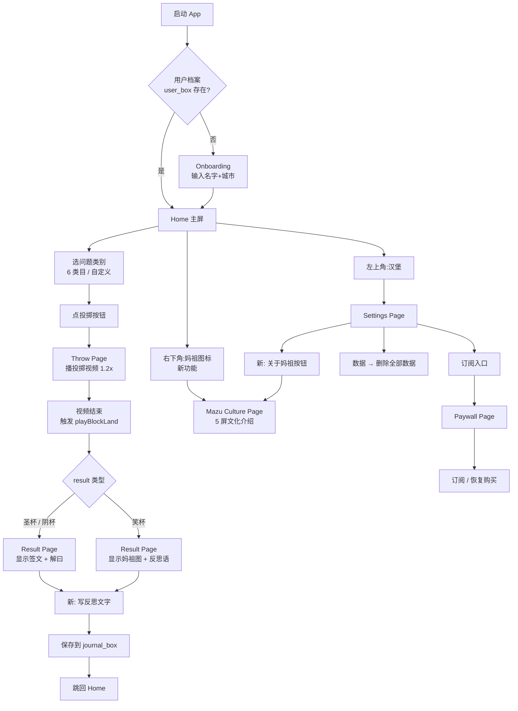
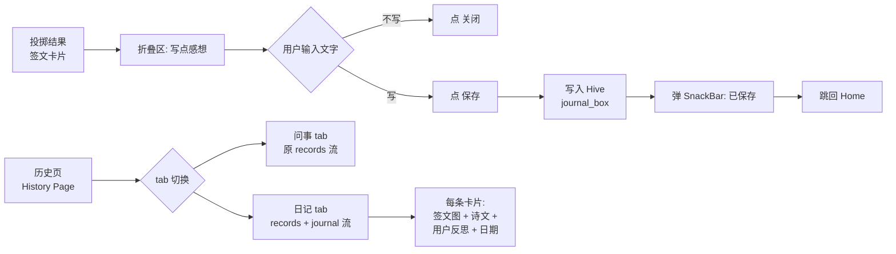
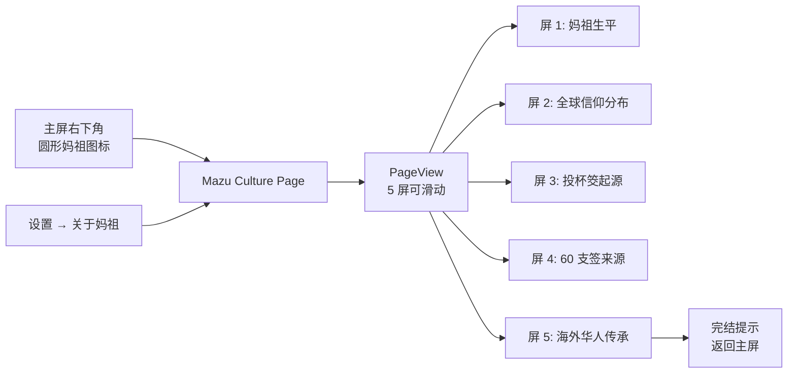

# Ask Mazu V1.1 — UX 流程设计稿

> 目标:从"fortune telling App"重新定位为"文化体验 + 每日反思 App",通过 Apple Guideline 4.3(b) 审核。
> 设计稿版本:V1.1(2026-10-02)

---

## 1. 主流程图(App Flow)



---

## 2. 新功能子流程

### 2.1 文化日记流程



**关键 UX**:写反思默认折叠,展开后**可选**填(0 字也能保存)— 减少用户摩擦。

### 2.2 妈祖文化模块流程



**关键 UX**:5 屏用 PageView 滑动,**首屏是大图 + 大字**,不要文字密集。

---

## 3. 关键页面 UX

### 3.1 Home(主屏) — 改动小

```
┌─────────────────────────────────┐
│  ☰    2026年10月2日             │  ← 顶栏(不变)
│       农历八月十三              │
│                                  │
│  ━━━━━━━━━━━━━━━━━━━━━━━━━━━━━ │
│  林默娘 弟子                    │  ← 名字+城市(不变)
│  现居上海                       │
│  ━━━━━━━━━━━━━━━━━━━━━━━━━━━━━ │
│                                  │
│  今日欲问何事?                  │
│  ┌──┐┌──┐┌──┐                  │
│  │事业││感情││财运│               │  ← 6 类目(不变)
│  └──┘└──┘└──┘                  │
│  ┌──┐┌──┐┌──┐                  │
│  │健康││家庭││学业│               │
│  └──┘└──┘└──┘                  │
│                                  │
│  [  想自己问一句?  ]            │  ← 自定义输入(不变)
│                                  │
│  ┌──────────────────────────┐    │
│  │   投 掷 杯 筊              │   │  ← 主按钮(不变)
│  └──────────────────────────┘    │
│                                  │
│  [⛩️ 妈祖]    体验还剩 1 天 · 续│  ← 状态栏(改)
│  角图标        文字+链接          │  ← 新增图标入口
└─────────────────────────────────┘
```

**新增元素**:
- **右下角圆形妈祖图标**(米白底 + 妈祖红 + ⛩️ emoji)→ 点进文化模块
- 状态栏从"免费体验还剩 X 天 · 升级无限"→ 改为"体验还剩 X 天 · 续"(不强调"升级",改"续")

### 3.2 Result Page(结果页) — 加文化反思区

```
┌─────────────────────────────────┐
│  ←                              │  ← 返回箭头
│                                  │
│       [杯筊图 圣杯 / 笑杯 / 阴]   │  ← 现有
│                                  │
│     [圣杯徽章]                   │  ← 现有
│                                  │
│   林默娘 弟子                    │  ← 现有(开场白)
│   妈祖允你所问                   │
│                                  │
│  ━━━━━━━━━━━━━━━━━━━━━━━━━━━━━ │
│                                  │
│   第 12 签 · 上签                │
│   [签文标题]                    │
│                                  │
│   盈眸海水接天涯                 │  ← 诗句(现有)
│   慈航普渡佑千家                 │
│                                  │
│   解 曰                          │
│   [解曰内容]                     │  ← 现有
│                                  │
│   现代解读                       │  ← 现有
│   • [bullet 1]                   │
│   • [bullet 2]                   │
│                                  │
│  ━━━━━━━━━━━━━━━━━━━━━━━━━━━━━ │
│                                  │  ← 新增区域
│  ✎  写点今天的想法(可选)        │  ← 默认折叠
│  ┌──────────────────────────┐    │
│  │ [TextField 多行]         │    │  ← 展开后
│  │                          │    │
│  └──────────────────────────┘    │
│  [取消]                    [保存] │
│                                  │
│  ━━━━━━━━━━━━━━━━━━━━━━━━━━━━━ │
│  本应用为文化体验,签文内容为     │  ← 新增 disclaimer
│  古典文学灵感,非预测建议         │    细字小灰
│                                  │
│  [分享]    [再问一次]            │  ← 现有
└─────────────────────────────────┘
```

**新增元素**:
- **"写点想法"可折叠区**(默认折叠,展开后可选填)
- 底部 **disclaimer**(小字细灰)

### 3.3 History Page — 改日记流

```
┌─────────────────────────────────┐
│  ← 问事记录                     │
│                                  │
│  [问事]   [日记]                │  ← 新增 tab 切换
│  ━━━━━━━━━                  │
│                                  │
│  切换到「日记」tab 后:           │
│                                  │
│  ┌──────────────────────────┐    │
│  │ 2026-10-02                │    │  ← 时间(新)
│  │ ╭─────╮                  │    │
│  │ │签杯 │ 第 12 签 · 上签   │    │  ← 签文卡片
│  │ ╰─────╯                  │    │
│  │                          │    │
│  │ [签文标题]                │    │
│  │ 盈眸海水接天涯            │    │
│  │ 慈航普渡佑千家            │    │
│  │                          │    │
│  │ ✎ [用户写的反思]           │    │  ← 新增:用户文字
│  │   今天面试有点紧张,但妈    │    │  (2026-10-02)
│  │   祖签文给我力量,继续      │    │
│  │   努力...                  │    │
│  └──────────────────────────┘    │
│                                  │
│  ┌──────────────────────────┐    │
│  │ 2026-10-01                │    │
│  │ ...                       │    │
│  └──────────────────────────┘    │
└─────────────────────────────────┘
```

**新增元素**:
- **tab 切换**(问事 / 日记)
- **日记卡片布局**:签文卡片 + 用户反思(如果有)

### 3.4 Mazu Culture Page(全新)

```
┌─────────────────────────────────┐
│  ←  认识妈祖                    │  ← 顶部导航
│  ━━━━━━━━━━━━━━━━━━━━━━━━━━━━━ │
│                                  │
│  [1/5]                  滑 →    │  ← PageView 指示
│                                  │
│  ┌──────────────────────────┐    │
│  │                          │    │
│  │      [大图:妈祖像]         │    │  ← 屏 1
│  │                          │    │
│  │   妈祖(960 - 987)         │    │
│  │   原名林默娘,福建莆田     │    │
│  │                          │    │
│  │   雍熙四年于海难中捨身     │    │
│  │   救人,民众感其恩德立庙    │    │
│  │   奉祀,尊称为"妈祖"       │    │
│  │                          │    │
│  └──────────────────────────┘    │
│                                  │
│  ● ○ ○ ○ ○                     │  ← 5 屏指示器
│                                  │
│  [滑到右边看下一页 →]             │  ← 提示
└─────────────────────────────────┘

切换到屏 2 (信仰分布):
┌─────────────────────────────────┐
│  全球妈祖信仰                    │
│                                  │
│     [世界地图]                   │
│     中国 / 港澳台 / 东南亚        │
│     / 北美 / 欧洲(共 30+ 国)     │
│                                  │
│     信众超过 2 亿                │
│     妈祖庙 5000+ 座              │
└─────────────────────────────────┘

屏 3-5 类似,各 1 张大图 + 短文字
```

**关键 UX**:
- 5 屏 PageView 可滑动,**首屏是大图 + 大字**(老人也能看)
- 每屏文字 ≤ 100 字
- 大图为主、文字为辅(让 Apple 看到"教育内容")

### 3.5 Paywall Page — 改措辞

```
┌─────────────────────────────────┐
│  关闭(X)        右上角            │  ← 关闭(不变)
│                                  │
│     传承妈祖文化                  │  ← 标题:改
│     感谢你与妈祖同行              │  ← 副标题:改
│                                  │
│  ━━━━━━━━━━━━━━━━━━━━━━━━━━━━━ │
│                                  │
│  ✓ 每日无限文化体验              │  ← 改:不再说"投掷"
│  ✓ 完整 60 支古典签文            │
│  ✓ 庙宇环境音 · 沉浸式体验       │
│                                  │
│  ┌──────────────────────────┐    │
│  │ 月度订阅                 │    │
│  │                          │    │
│  │ $0.99 / 月                │    │
│  │                          │    │
│  │ 本订阅为文化体验订阅,仅     │    │  ← 新增 disclaimer
│  │ 用于解锁完整内容,非预测服务 │    │    (订阅按钮上方)
│  │                          │    │
│  │ [   立即订阅   ]          │    │  ← 按钮文字不变
│  └──────────────────────────┘    │
│                                  │
│  [恢复购买]                       │  ← 不变
│                                  │
│  继续即代表同意                   │  ← 不变
│  [用户协议] · [隐私政策]          │
└─────────────────────────────────┘
```

**关键改动**:
- 标题 "解锁妈祖全部指引" → **"传承妈祖文化"**
- 副标题 "感谢你与妈祖同行" → **"感谢你与妈祖同行"**(不变,但去掉暗示)
- 3 个 bullet 中 "每日无限次投掷" → **"每日无限文化体验"**

---

## 4. 文案改写对照(关键部分)

| 位置 | 旧 | 新 |
|---|---|---|
| 副标题 | 每日一问,妈祖指引 | 传承妈祖文化 · 每日一记 |
| App 描述(英) | "throw blocks...seek guidance" | "explore cultural heritage...daily reflection" |
| 关键词 | `fortune,divination` | `culture,heritage,mindfulness,poetry` |
| Paywall 标题 | 解锁妈祖全部指引 | 传承妈祖文化 |
| Paywall bullet 1 | 每日无限次投掷 | 每日无限文化体验 |
| Disclaimer | (无) | "为文化体验,非预测服务" |
| 描述叙事 | "seek Mazu's guidance on daily decisions" | "explore traditional Chinese cultural heritage" |

---

## 5. 改动清单(实施时按这个走)

### 必做(Day 1)
- [ ] `pubspec.yaml`:1.0.2+5 → 1.1.0+6
- [ ] `app_zh.arb` / `app_en.arb` / `app_zh_TW.arb`:加 disclaimer 字符串
- [ ] `app_review_notes.md`:重写,删所有 "fortune / guidance" 词
- [ ] `result_page.dart`:加底部 disclaimer + "写反思"折叠区
- [ ] `paywall_page.dart`:改标题/副标题/bullet 措辞 + 加订阅按钮上方 disclaimer

### 重点(Day 2-3)
- [ ] 新建 `lib/data/models/journal_entry.dart` + HiveAdapter
- [ ] 新建 `lib/data/repositories/journal_repository.dart`
- [ ] `pubspec.yaml` 加 assets/audio/ 和注册 journalAdapter
- [ ] `main.dart` 注册 HiveAdapter
- [ ] `record_repository.dart` 加 `getBySignId`
- [ ] `result_page.dart`:写反思的 textfield + 提交 + 保存
- [ ] `history_page.dart`:加 tab 切换,显示日记流
- [ ] 6 个 ARB 新 key

### 重点(Day 4)
- [ ] 新建 `lib/features/about/mazu_culture_page.dart`(5 屏 PageView)
- [ ] `home_page.dart`:右下角加 ⛩️ 图标入口
- [ ] `settings_page.dart`:关于页加"认识妈祖"按钮
- [ ] 4-5 张文化页大图(PNG,750×1000,放 assets/images/culture/)
- [ ] ARB 新 key

### 收尾(Day 5)
- [ ] `flutter analyze` 通过
- [ ] iOS 模拟器走通主流程
- [ ] `flutter build ios --release` 出新 build
- [ ] 重新上传 App Store Connect(版本 1.1.0 build 6)
- [ ] App Review Notes 粘贴新版本
- [ ] Resolution Center 回复 Apple:重提交 1.1.0,定位改为文化体验
- [ ] commit + push GitHub

---

## 6. 风险预案

| 风险 | 应对 |
|---|---|
| V1.1 还是被 4.3b 拒(Apple 不认"日记"包装) | 加"妈祖文化社区"功能(V1.2),纯社区/分享 — 更明显不是占卜 |
| 文化页 PNG 美术做不出来 | 临时用纯文字 + 妈祖符号 emoji(⛩️ 🙏 妈祖),后续找设计师 |
| 5 屏文化页太单薄 Apple 还是判占卜 | 加"中国非遗知识"长文 / 视频 / 引用来源,显出教育深度 |
| 账号删除 + 日记删除要联动 | 5 个 Hive box 全清(已写好),日记也清 |

---

**等你拍板**:
- "干" → 按这个清单开干
- "改 X" → 你想调整哪里
- "先出其中一两个的详细代码" → 我可以先做 Day 1 的部分给你看效果
